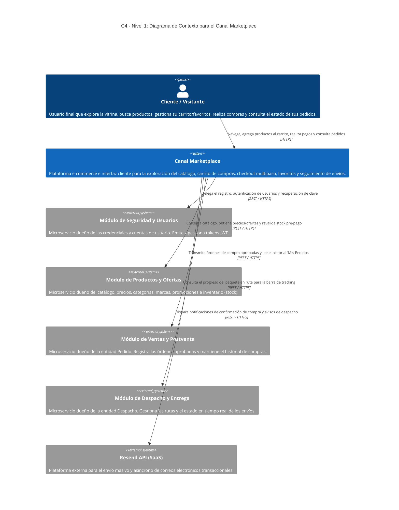
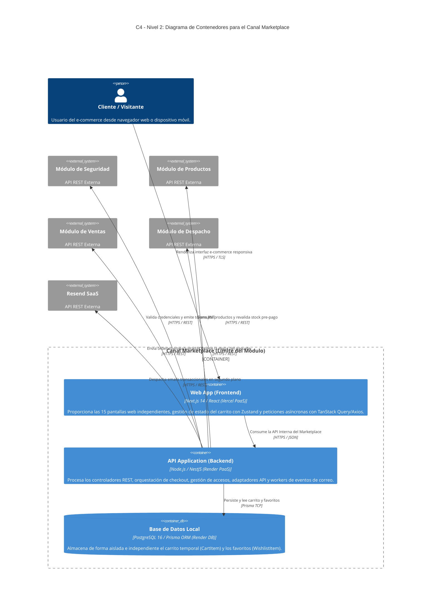

A continuación se presenta el **Modelo C4 Completo** para el **Canal Marketplace**, formalizado en sus tres primeros niveles de abstracción (Contexto, Contenedores y Componentes) en sintaxis **Mermaid C4** [70, 71, 73–76].

---

### **Nivel 1: Diagrama de Contexto del Sistema (System Context)**

El Nivel 1 muestra la visión global del **Canal Marketplace** dentro del ecosistema de microservicios deportivos, detallando sus interacciones con el cliente y con los sistemas externos.

---

### **Nivel 2: Diagrama de Contenedores (Containers)**

El Nivel 2 desglosa la arquitectura tecnológica del **Canal Marketplace** en sus unidades de ejecución y despliegue independientes (Frontend, Backend y Persistencia Local).

---

### **Nivel 3: Diagrama de Componentes (Components)**

El Nivel 3 hace un _zoom-in_ dentro de la **API Application (Backend de NestJS)**, detallando la interacción entre los **Controladores HTTP (Capa A)**, los **Servicios de Dominio (Capa B)**, la **Persistencia Local (Capa C)** y los **Adaptadores Externe API / Capa Anti-Corrupción (Capa D)** [73–76].

```mermaid.js
C4Component
    title C4 - Nivel 3: Diagrama de Componentes Internos (Backend NestJS)

    Container(web_app, "Web App (Next.js)", "Frontend Client", "Envía peticiones HTTP/REST.")
    ContainerDb(db_local, "PostgreSQL Local", "Prisma ORM", "Almacena CartItem y WishlistItem.")

    Container_Boundary(b1, "API Application (Backend NestJS)") {

        %% CAPA A: CONTROLADORES REST
        Component(auth_ctrl, "Auth Controller", "@Controller('/auth')", "Maneja peticiones de login, registro y recuperación.")
        Component(catalog_ctrl, "Catalog Controller", "@Controller('/products')", "Recibe peticiones de búsqueda, catálogo, filtros y ficha técnica.")
        Component(cart_ctrl, "Cart & Wishlist Controller", "@Controller('/cart')", "Maneja la adición, edición, eliminación y favoritos.")
        Component(checkout_ctrl, "Checkout Controller", "@Controller('/checkout')", "Recibe direcciones, cupones y simulación de pago.")
        Component(orders_ctrl, "Orders & Tracking Controller", "@Controller('/orders')", "Recibe solicitudes de historial 'Mis Pedidos' y tracking.")

        %% CAPA B: SERVICIOS DE DOMINIO Y ORQUESTADORES
        Component(cart_srv, "Cart & Wishlist Service", "@Injectable()", "Calcula subtotales en tiempo real, unifica carritos anónimos tras el login y gestiona favoritos.")
        Component(checkout_orch, "Checkout Orchestrator", "@Injectable()", "Coordina el flujo multipaso: ejecuta la revalidación de stock pre-pago y empaqueta la orden.")
        Component(notif_worker, "Notification Worker", "@Injectable()", "Event Listener que escucha 'order.created' y despacha emails con React Email/Resend SDK.")
        Component(event_emitter, "NestJS Event Emitter", "EventEmitter2", "Bus de eventos interno para desacoplar el envío de correos.")

        %% CAPA C: PERSISTENCIA LOCAL
        Component(prisma_srv, "Prisma Service", "@Injectable()", "Cliente ORM tipado para acceso a PostgreSQL local.")

        %% CAPA D: ADAPTADORES DE INTEGRACIÓN (CAPA ANTI-CORRUPCIÓN)
        Component(sec_adapter, "Security Adapter", "Adapter Service", "Aísla llamadas al Módulo de Seguridad.")
        Component(prod_adapter, "Products Adapter", "Adapter Service", "Aísla consultas de catálogo y revalidación de stock.")
        Component(sales_adapter, "Sales Adapter", "Adapter Service", "Aísla el empaquetado de órdenes hacia Ventas.")
        Component(disp_adapter, "Dispatch Adapter", "Adapter Service", "Aísla consultas de tracking hacia Despacho.")
        Component(http_srv, "HttpService / Mocks", "@nestjs/axios", "Wrapper Axios con interceptor axios-mock-adapter según USE_MOCKS.")
    }

    System_Ext(ext_sec, "Módulo Seguridad", "API REST")
    System_Ext(ext_prod, "Módulo Productos", "API REST")
    System_Ext(ext_sales, "Módulo Ventas", "API REST")
    System_Ext(ext_disp, "Módulo Despacho", "API REST")
    System_Ext(ext_resend, "Resend API", "SaaS REST")

    %% RELACIONES INTERNAS
    Rel(web_app, auth_ctrl, "POST /auth/*", "JSON")
    Rel(web_app, catalog_ctrl, "GET /products/*", "JSON")
    Rel(web_app, cart_ctrl, "GET, POST, DELETE /cart/*", "JSON")
    Rel(web_app, checkout_ctrl, "POST /checkout/*", "JSON")
    Rel(web_app, orders_ctrl, "GET /orders/*", "JSON")

    Rel(auth_ctrl, sec_adapter, "Delega autenticación")
    Rel(catalog_ctrl, prod_adapter, "Delega consultas de catálogo")
    Rel(cart_ctrl, cart_srv, "Delega cálculo e ítems")
    Rel(checkout_ctrl, checkout_orch, "Delega orquestación de pago")
    Rel(orders_ctrl, sales_adapter, "Consulta historial")
    Rel(orders_ctrl, disp_adapter, "Consulta tracking")

    Rel(cart_srv, prisma_srv, "CRUD CartItem / WishlistItem")
    Rel(cart_srv, prod_adapter, "Valida stock de ítems")
    Rel(checkout_orch, prod_adapter, "Ejecuta revalidación pre-pago")
    Rel(checkout_orch, sales_adapter, "Transmite orden empaquetada")
    Rel(checkout_orch, event_emitter, "Emite evento 'order.created'")
    Rel(event_emitter, notif_worker, "Dispara notificación asíncrona")

    Rel(prisma_srv, db_local, "Consulta / Modifica", "Prisma TCP")

    Rel(sec_adapter, http_srv, "Llamada HTTP saliente")
    Rel(prod_adapter, http_srv, "Llamada HTTP saliente")
    Rel(sales_adapter, http_srv, "Llamada HTTP saliente")
    Rel(disp_adapter, http_srv, "Llamada HTTP saliente")

    Rel(http_srv, ext_sec, "Petición REST / Mocks", "HTTPS")
    Rel(http_srv, ext_prod, "Petición REST / Mocks", "HTTPS")
    Rel(http_srv, ext_sales, "Petición REST / Mocks", "HTTPS")
    Rel(http_srv, ext_disp, "Petición REST / Mocks", "HTTPS")
    Rel(notif_worker, ext_resend, "Despacha email en segundo plano", "HTTPS")
```

