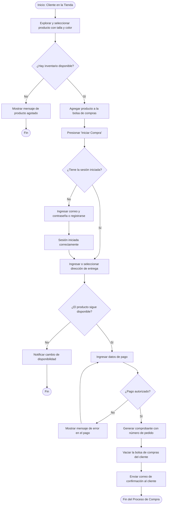
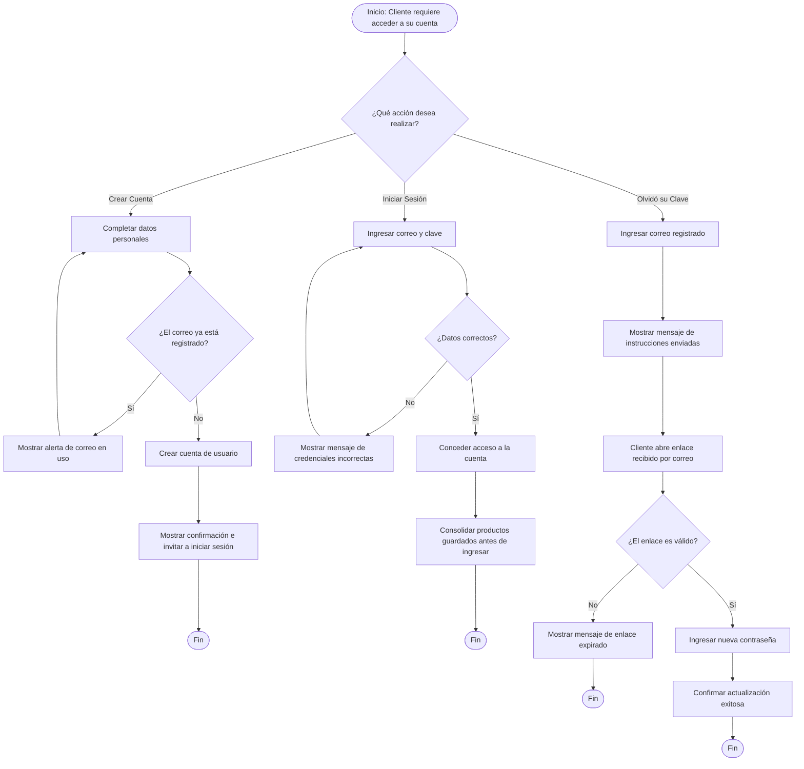
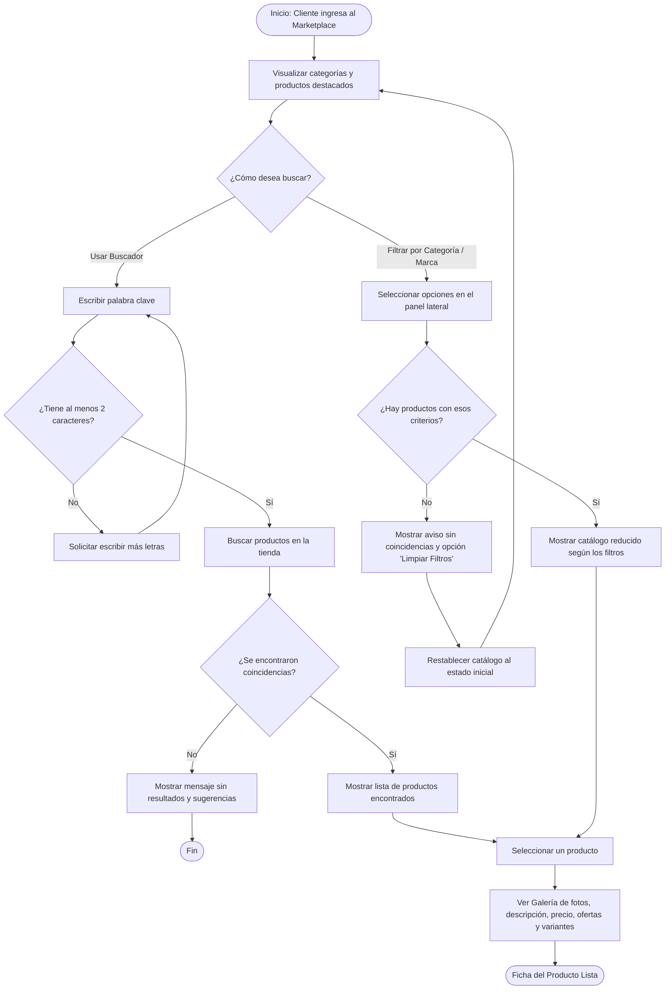
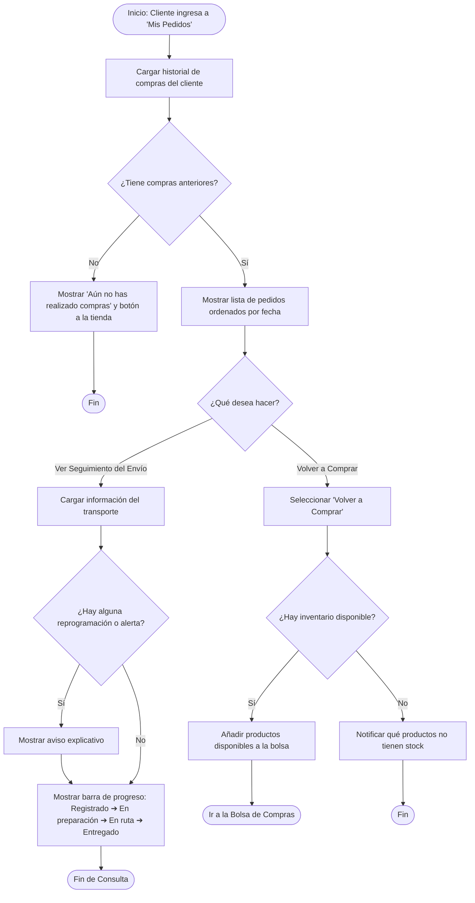
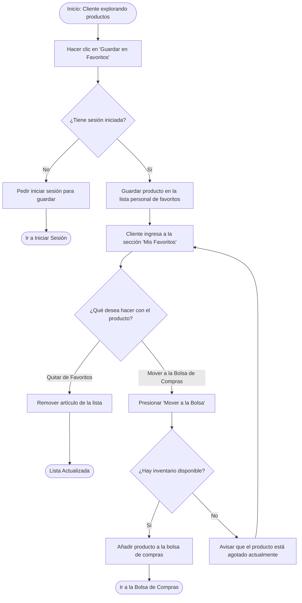
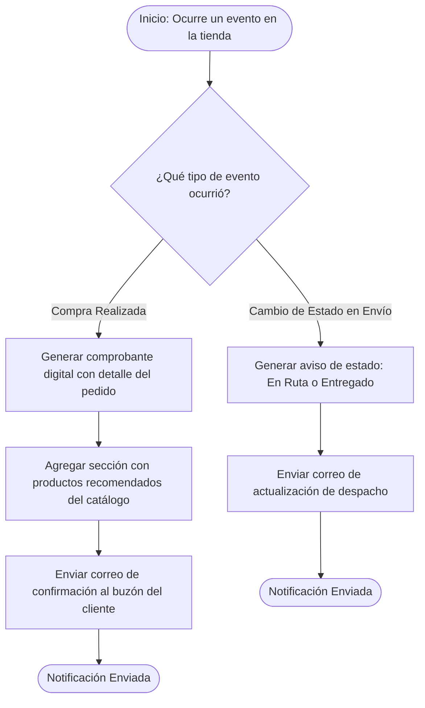

Aquí tienes el conjunto completo e integral de los **6 Diagramas de Procesos a Alto Nivel** en formato **`mermaid.js`**, diseñados con enfoque exclusivamente de negocio y experiencia del cliente para cubrir el 100% de las 7 Épicas y 22 Historias de Usuario.

---

### **1. Proceso de Selección y Compra de Productos (`EP-ITC`, `EP-TRX`, `EP-SNT`)**

Describe el recorrido funcional del cliente desde la selección de artículos en la vitrina hasta la confirmación de la compra y la emisión del comprobante digital.

---

### **2. Proceso de Registro y Acceso a la Cuenta (`EP-GAC`, `EP-ITC`)**

Muestra los caminos de decisión para el registro de nuevos usuarios, el inicio de sesión y el flujo seguro de recuperación de credenciales.

---

### **3. Proceso de Exploración y Búsqueda en el Catálogo (`EP-VEC`, `EP-DDP`)**

Representa la interacción del usuario con la vitrina comercial mediante la barra de búsqueda por palabras clave, combinaciones de filtros laterales y la ficha de producto.

---

### **4. Proceso de Historial de Compras y Seguimiento de Envío (`EP-SHP`)**

Contempla la lectura de pedidos pasados, el filtrado dinámico por estado, la opción de volver a comprar (_reorder_) y el seguimiento de la trayectoria del paquete.

---

### **5. Proceso de Gestión de Lista de Deseos / Favoritos (`EP-ITC`)**

Detalla cómo el cliente registrado guarda artículos de interés en su espacio personal y los traslada a la bolsa de compras tras validar su disponibilidad.

---

### **6. Proceso de Notificaciones y Comunicaciones al Cliente (`EP-SNT`)**

Describe la emisión automática de comunicaciones por correo electrónico para confirmaciones de compra, catálogo de productos recomendados y avances en la entrega.

---

### **Resumen de Cobertura de Requerimientos**

|N° Diagrama|Nombre del Proceso|Épicas Asociadas|Cobertura Funcional del Proyecto|
|:--|:--|:--|:--|
|**1**|Selección y Compra|`EP-ITC`, `EP-TRX`, `EP-SNT`|Carrito, validaciones de stock, checkout multipaso, simulación de pago y confirmación.|
|**2**|Registro y Acceso|`EP-GAC`, `EP-ITC`|Formulario de registro, login con sesión activa, recuperación de clave y unificación de bolsa.|
|**3**|Exploración y Búsqueda|`EP-VEC`, `EP-DDP`|Portada comercial, buscador por palabra clave, filtros por categoría/marca y ficha técnica.|
|**4**|Historial y Seguimiento|`EP-SHP`|Visor "Mis Pedidos", filtrado por estado, barra de progreso de envío y opción _reorder_.|
|**5**|Lista de Deseos|`EP-ITC`|Persistencia de favoritos, eliminación y traslado a bolsa con revalidación de stock.|
|**6**|Notificaciones|`EP-SNT`|Correos de confirmación de pedido, catálogo de recomendación y avisos de despacho.|

---

🎨 Con estos 6 diagramas de procesos listos a alto nivel, ¿procedemos a redactar la especificación del **Mapa de Navegación de Pantallas y Wireframes** para maquetar los prototipos del **Hito 2** en **Stitch AI / Figma**?