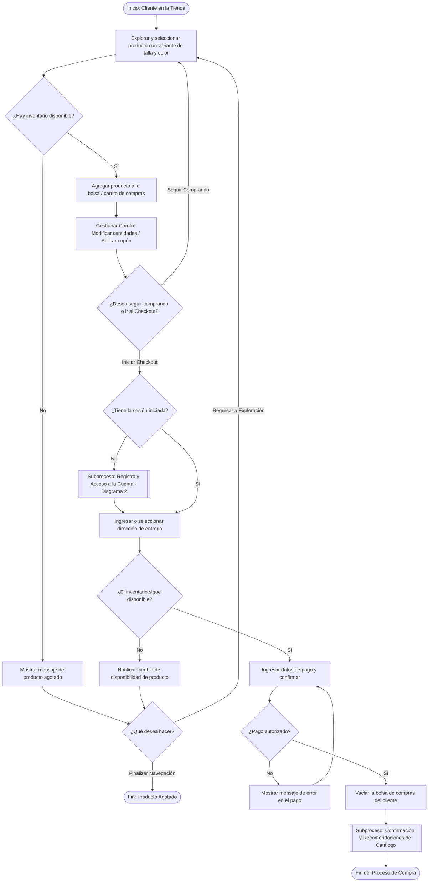
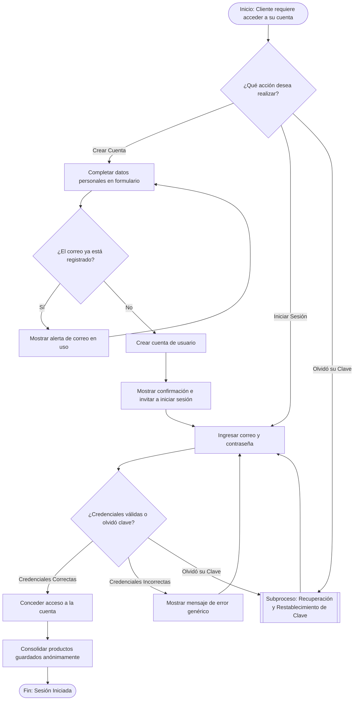
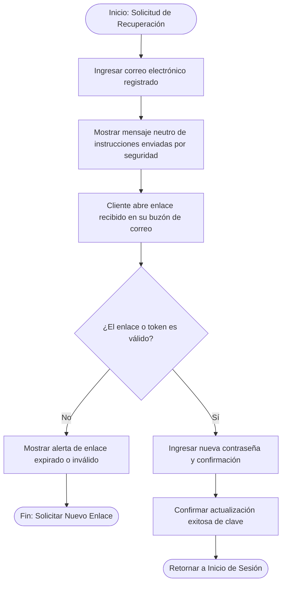
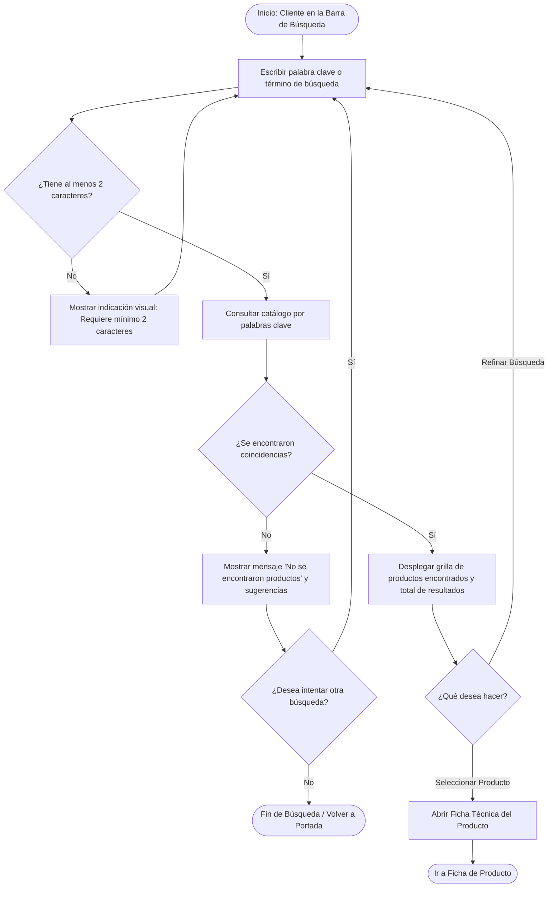
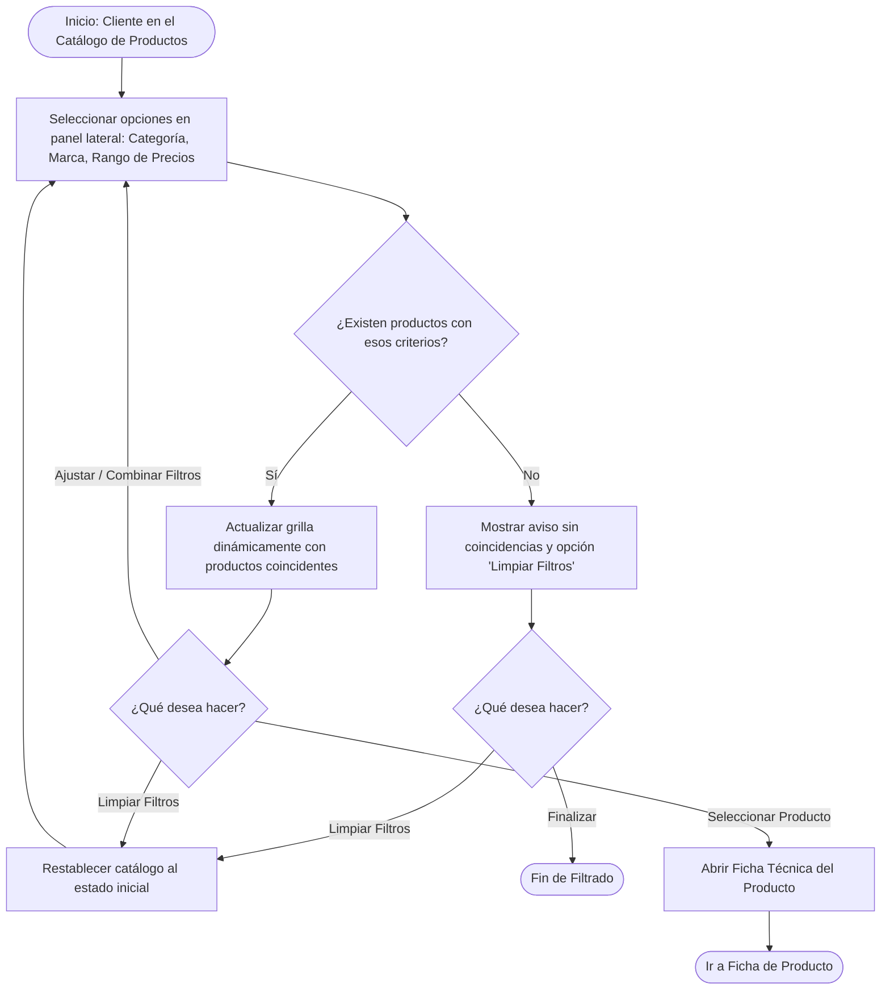
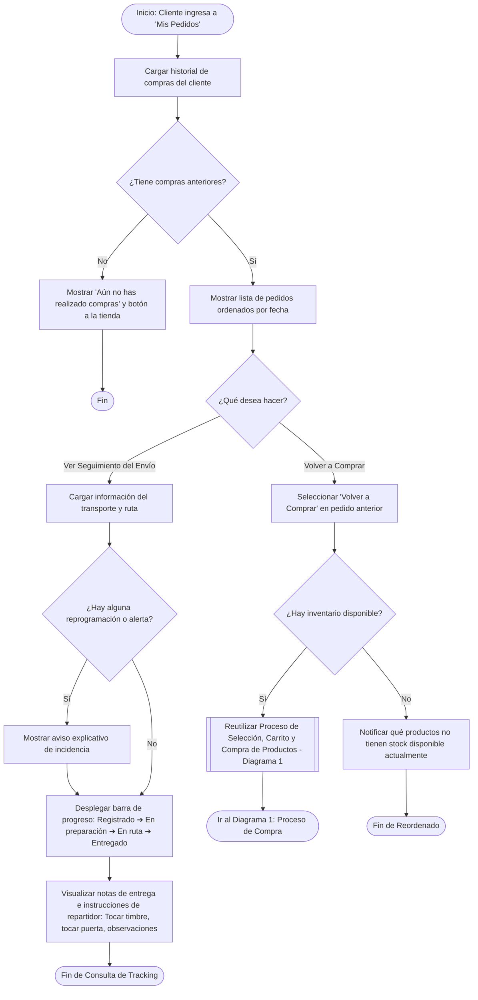
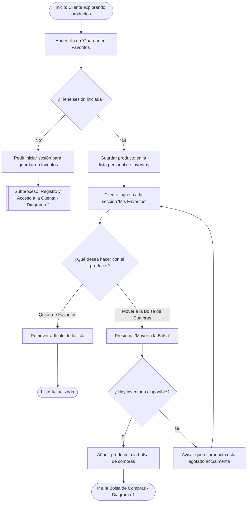
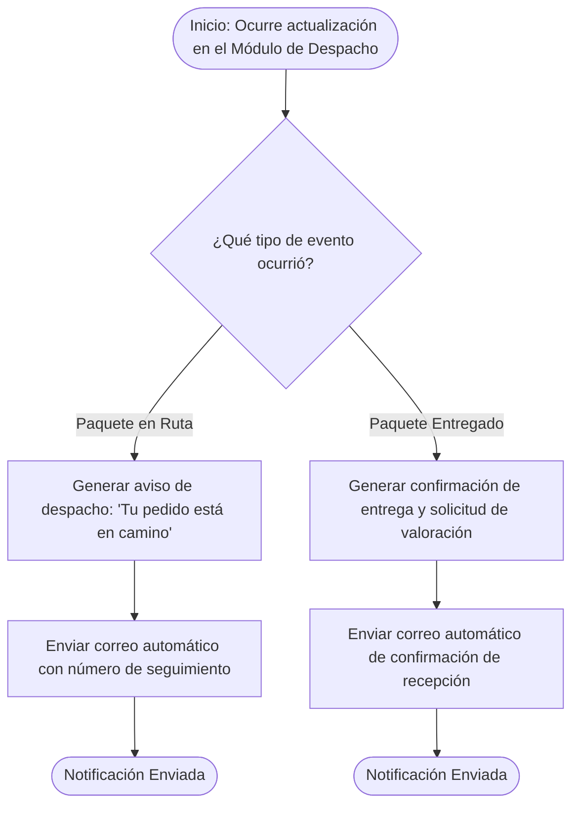
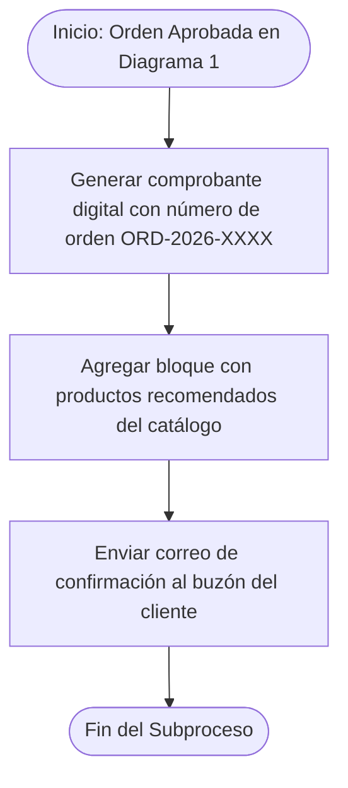

### **1. Proceso de Selección, Carrito y Compra de Productos (EP-ITC, EP-TRX, EP-SNT)**

Describe el recorrido funcional completo del cliente desde la selección de artículos en la vitrina hasta la confirmación de la compra y la emisión de recomendaciones. Incorpora la gestión del carrito como proceso cíclico, un nuevo rombo de decisión ante productos agotados y la integración del **Subproceso de Confirmación y Recomendaciones de Catálogo**.

---

### **2. Proceso de Registro y Acceso a la Cuenta (EP-GAC, EP-ITC)**

Muestra los caminos de decisión para el registro de nuevos usuarios, el inicio de sesión y la delegación del flujo "Olvidó su clave" como un **subproceso reutilizable** que retorna al inicio de sesión tras actualizar las credenciales.

#### **Subproceso: Recuperación y Restablecimiento de Clave (Reutilizable)**

---

### **3. Procesos de Búsqueda y Filtrado en el Catálogo (EP-VEC, EP-DDP)**

Se ha dividido la exploración en dos diagramas independientes y cíclicos para permitir búsquedas continuas y ajustes dinámicos de catálogo sin perder el flujo de navegación.

#### **Diagrama 3A: Proceso de Búsqueda de Productos por Palabra Clave**

#### **Diagrama 3B: Proceso de Navegación y Filtrado Dinámico por Categorías y Marcas**

---

### **4. Proceso de Historial de Compras y Seguimiento de Envío (EP-SHP)**

Contempla la lectura de pedidos pasados, el seguimiento del paquete con notas de entrega (*tocar timbre, tocar puerta, etc.*) y la reutilización explícita del **Proceso de Selección, Carrito y Compra (Diagrama 1)** para la opción de volver a comprar (*reorder*).

---

### **5. Proceso de Gestión de Lista de Deseos / Favoritos (EP-ITC)**

Detalla cómo el cliente registrado guarda artículos de interés en su espacio personal y los traslada a la bolsa de compras tras validar su disponibilidad.

---

### **6. Proceso de Notificaciones y Comunicaciones de Despacho (EP-SNT)**

Centrado en las notificaciones automáticas en segundo plano enviadas al cliente durante el ciclo de vida del despacho (*En Ruta / Entregado*). El subproceso de confirmación de compra y recomendaciones de catálogo se ha desacoplado para ser ejecutado directamente en el **Diagrama 1**.

#### **Subproceso: Confirmación y Recomendaciones de Catálogo (Invocado desde Diagrama 1)**

---

### **Resumen de Cobertura y Cambios Estructurales**

| N° Diagrama | Nombre del Proceso | Novedades e Integración |
| :---: | :--- | :--- |
| **1** | Selección, Carrito y Compra | Carrito de compras cíclico, rombo de decisión si no hay stock (regresar a exploración o terminar) y llamada al subproceso de confirmación/recomendaciones. |
| **2** | Registro y Acceso a la Cuenta | Subproceso reutilizable de "Olvidó su clave" enlazado con el formulario de Inicio de Sesión. |
| **3A** | Búsqueda por Palabra Clave | Proceso independiente con validación de longitud (mínimo 2 letras) y bucles para intentar nuevas búsquedas. |
| **3B** | Filtrado Dinámico de Catálogo | Proceso independiente con combinación de filtros laterales, limpieza en un clic y bucles de ajuste. |
| **4** | Historial y Tracking de Envío | Reutilización directa del **Diagrama 1** para la opción *Volver a Comprar* e inclusión de **notas para seguimiento de envío** (tocar puerta, tocar timbre, etc.). |
| **5** | Lista de Deseos / Favoritos | Transferencia de favoritos hacia el carrito de compras previa validación de inventario. |
| **6** | Notificaciones de Despacho | Centrado en notificaciones de envío (*En Ruta / Entregado*). La confirmación de pedido y recomendaciones pasó al Diagrama 1. |
