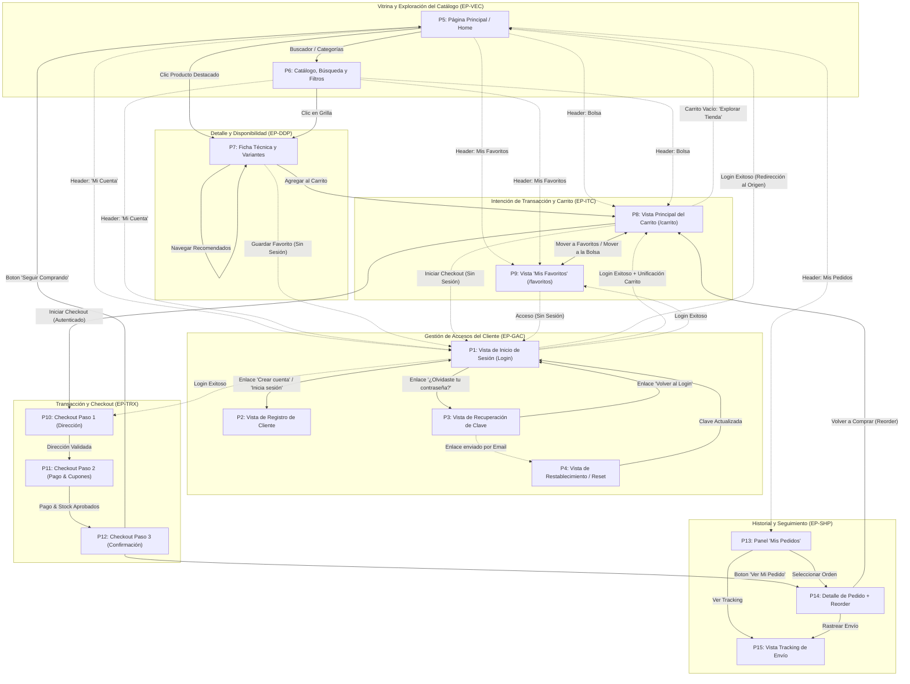

**Sí, es necesario actualizar el diagrama de navegación del canal** [128–130].

Al redefinir la **Pantalla 8 (P8: Carrito de Compras)** para que sea una **vista de página completa independiente (`/carrito`)** en lugar de un panel lateral emergente (_drawer_), la arquitectura de navegación cambia en los siguientes puntos clave:

1. **Ruta Dedicada del Carrito (`/carrito`)**: La navegación desde el botón "Bolsa" de la cabecera (P5, P6), el botón "Agregar al Carrito" de la ficha técnica (P7) o la acción "Mover a la Bolsa" de Favoritos (P9) pasa a ser una transición de página completa hacia **P8** [129, 186–188].
2. **Estado Vacío y Retorno al Catálogo**: La **P8** incorpora un flujo directo de retorno mediante el botón **"Explorar Tienda"** hacia la vitrina (**P5/P6**).
3. **Flujo de Autenticación Interceptado**: Si el usuario no tiene sesión iniciada al hacer clic en **"Iniciar Checkout"** dentro de **P8**, la aplicación lo redirige a la pantalla completa de **Inicio de Sesión (P1)**, unificando la bolsa anónima previa y permitiendo el paso posterior al **Checkout Paso 1 (P10)**.

---

### **Diagrama de Navegación Actualizado del Canal (15 Pantallas Web)**

---

🛒 Con esta actualización, tanto la especificación formal del prototipo (**`especificacion-pantallas-prototipo-v5.md`**) como el **Diagrama de Navegación** reflejan la misma estructura para la generación en **Stitch AI**.